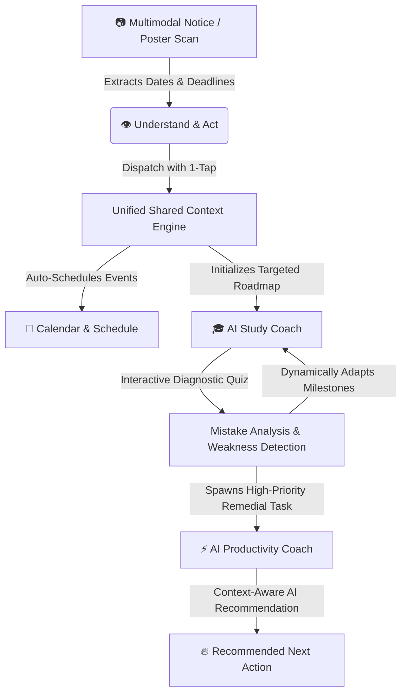

# L.A.S.A. — Local AI Smartphone Assistant 📱⚡

[](https://react.dev/)
[](https://vitejs.dev/)
[](https://www.typescriptlang.org/)
[](https://ai.google.dev/)
[](https://vercel.com/)

> **Built for the iQOO Hackathon**  
> An on-device-inspired smartphone assistant combining **Multimodal Document Vision**, an **Adaptive AI Study Coach**, and an **Action-Driven Productivity Coach** connected by a **Unified Shared Context Engine**.

---

## 💡 The Core Innovation: Unified Shared Context

Most mobile AI features operate in isolation: scanning a document doesn't update your study roadmap, and missing an exam question doesn't trigger prioritized preparation tasks.

**L.A.S.A. connects three workflows into one intelligent closed loop:**



---

## ✨ Features & Modes

### 1. 👁️ AI Understand & Act (Multimodal Vision)
- **Document & Poster Parsing**: Upload or capture exam circulars, syllabus notices, assignment briefs, or event posters.
- **Smart Entity Extraction**: Automatically isolates event dates, times, locations, and action items.
- **One-Touch Cross-Mode Dispatch**: Instantly distributes extracted intelligence into Calendar, Productivity tasks, and Study Coach.

### 2. 🎓 AI Study Coach (Adaptive Learning Loop)
- **Adaptive Study Plan Generator**: Generates custom multi-day preparation schedules broken down by subject, daily available study time, and target goals.
- **Dynamic Diagnostic Quizzes**: Generates conceptual multiple-choice questions on demand.
- **Mistake Analysis & Dynamic Adaptation**: Evaluates user answers, isolates specific concept weaknesses, and **dynamically injects remedial recovery sessions** into the study plan.

### 3. ⚡ AI Productivity Coach (Context-Aware Action)
- **Smart Next Action Card**: Synthesizes upcoming exams, active study milestones, and recent quiz mistakes to recommend the single most important action right now.
- **AI Sub-step Breakdown**: Splits complex tasks into atomic, actionable steps.
- **Prioritization Matrix**: High, medium, and low urgency sorting with cross-mode origin tracking.

---

## 🎨 Smartphone-First Experience

- **Cyber Dark & Clean Light Themes**: Instant theme toggle with local storage memory.
- **Gesture & Keyboard Navigation**: Press `1`, `2`, or `3` to jump across modes, or swipe horizontally on touch devices.
- **Zero-Failure Failover Engine**: Double-layered AI pipeline with live Gemini 1.5 Flash API calls and automatic high-fidelity simulation failover (ensuring 100% demo stability under any network condition).

---

## 🚀 Quick Start & Local Setup

### Prerequisites
- Node.js (v18+)
- npm

### Installation
```bash
# 1. Clone the repository
git clone https://github.com/Kaustubh-Negi-01/L.A.S.A_System.git

# 2. Enter project directory
cd L.A.S.A_System

# 3. Install dependencies
npm install

# 4. Start local development server
npm run dev
```

Open [http://localhost:3000](http://localhost:3000) in your browser.

---

## 👥 The Team

* **Kaustubh** *(Team Lead)* — Study Coach, Shared Context Engine, Integration, Deployment
* **Santhosh** — UI/UX, Smartphone App Shell, Understand & Act Multimodal Scanner
* **Hamza** — Gemini AI Services, Productivity Coach, AI Pipelines

---

## 📄 License
MIT License
