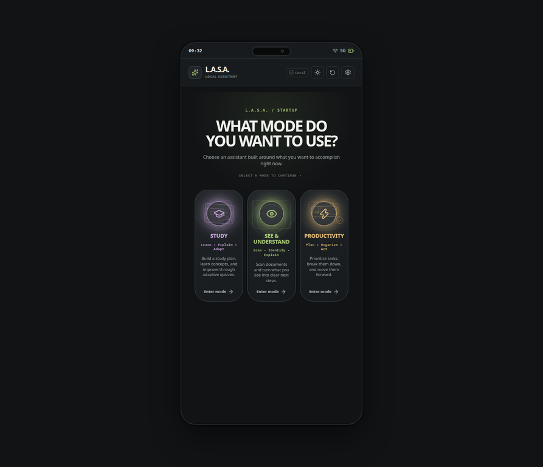
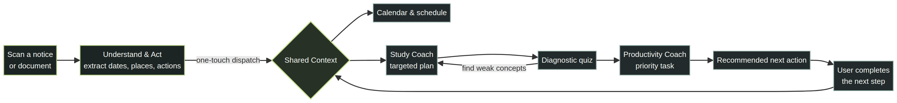

# L.A.S.A.

## Local AI Smartphone Assistant

> **A context-aware assistant for the moment between receiving information and knowing what to do next.**
>
> L.A.S.A. turns a notice, exam circular, assignment brief, or event poster into a coordinated plan: it understands the information, prepares the user, and moves the next action forward.

<p align="center">
  
</p>

<p align="center">
  <strong>Built for the iQOO Hackathon</strong><br />
  <a href="https://lasa-smartphone-assistant.vercel.app/">Open the browser prototype</a>
</p>

> **Prototype notice:** L.A.S.A. was originally conceived to become an Android APK. To make judging and sharing easier, the current demonstration is hosted as a browser-based smartphone experience. It is a working prototype, so occasional glitches may occur. This build does **not** represent the final product or final Android build. The core workflow is being validated now; more capabilities, deeper device integration, and production hardening are planned next.

---

## The problem

Important information arrives in fragments. A student sees an exam circular in one app, keeps a study plan somewhere else, and remembers the deadline only when it becomes urgent. Existing assistants can answer a question, but they often stop before the user reaches the next useful action.

L.A.S.A. explores a different model: an assistant that maintains a shared understanding of the user’s immediate goals. A scanned exam notice can become a calendar event, a targeted study plan, and a prioritized task without asking the user to manually copy information between tools.

## The idea in one sentence

**L.A.S.A. is a mobile-first closed loop that converts unstructured information into understanding, preparation, and action.**

## Why this is a strong fit for iQOO users

An iQOO phone is a natural home for an assistant designed around quick, high-intent interactions. L.A.S.A. is not a desktop dashboard squeezed into a mobile layout; the prototype is shaped as a smartphone experience with a device frame, touch-sized controls, mode-based navigation, gesture-like screen transitions, lock-screen and notification-shade concepts, and short feedback cues for meaningful actions.

For an iQOO user, the experience can become a fast daily layer above study, deadlines, and personal productivity. A user could capture a notice, review the extracted date and location, send it to the right planning surfaces, and return later to the single recommended next action. The current prototype does not claim to be an official iQOO system integration. Instead, it demonstrates a product direction that could later connect to iQOO device capabilities such as camera capture, notifications, calendar surfaces, intelligent search, and on-device privacy controls through appropriate platform or OEM APIs.

The most important design principle is **low friction**: useful assistance should feel like a natural extension of the phone, not another complex app that demands a long setup process.

---

## The core innovation: shared context across three modes

The three modes are intentionally connected rather than isolated features.



| Mode | What it does | What it contributes to the loop |
| --- | --- | --- |
| **Understand & Act** | Reads a notice, poster, document, or image and extracts useful facts. | Creates structured dates, places, deadlines, and action items. |
| **Study Coach** | Builds a focused plan and uses diagnostic practice to identify weak concepts. | Turns upcoming goals and mistakes into targeted preparation. |
| **Productivity Coach** | Prioritizes tasks and breaks larger work into smaller steps. | Recommends the next practical action at the right time. |

The result is a simple loop: **capture → understand → plan → practice → prioritize → act**. When the user completes an action or discovers a weakness, that information can feed the shared context again.

---

## A 90-second judge walkthrough

1. Start at the mode selector and notice that the interface is presented as a smartphone rather than a traditional web dashboard.
2. Enter **Understand & Act** and inspect the preloaded exam circular. The prototype surfaces the date, time, location, and extracted action items.
3. Use the one-touch dispatch action. In the intended product flow, the extracted information becomes connected schedule, study, and productivity context.
4. Open **Study Coach**. Review the adaptive plan, start the quiz, and select an answer to see the learning interaction.
5. Open **Productivity**. Review the recommended next action, task filters, completion interaction, and calendar items.
6. Open **Settings** to see the execution strategy, local feedback controls, reset action, and shared-context inspector. Use **SWITCH MODE** to return to the selector.
7. On a touch device, try horizontal workspace swipes and the bottom gesture area. The prototype also includes a lock-screen and notification-shade concept for demonstrating how the assistant could become part of a phone-level experience.

---

## What is implemented today

### Understand & Act

The multimodal scanner experience demonstrates how an image or document can be translated into structured information. In the prototype, the exam circular exposes the detected event title, date, time, location, and action items. The user can open a calendar link, dispatch the information across modes, or scan another document.

### Study Coach

The Study Coach presents a multi-day plan, daily milestones, weak-topic context, and a short diagnostic quiz. Selecting an answer updates the quiz state, and the existing flow is designed to support follow-up adaptation rather than treating a quiz as a disconnected form.

### Productivity Coach

The Productivity workspace surfaces a recommended next action, active tasks, task filters, priorities, sub-step controls, completion and reopen behavior, and extracted calendar events. Completing a task produces a full-card strike-through, a short success state, and a counter update so the interface communicates progress clearly.

### Smartphone system layer

The browser prototype includes a centered phone shell, status area, app header, bottom navigation, touch-safe press states, gesture-like screen transitions, lock-screen and notification-shade concepts, interactive quick settings, and Settings contained inside the device border. The goal is to make the demonstration feel like a phone interaction even when it is opened on a laptop.

### Settings and execution modes

The user can switch between **Demo Simulation** and optional **Live Gemini API** execution. Simulation mode keeps the demonstration usable without a key or network dependency. The Settings panel also exposes an optional Gemini key override, curated sound cues, visual haptics, local demo reset, and a live shared-context inspector.

---

## Technical architecture, explained plainly

| Technical term | Plain-English meaning in L.A.S.A. |
| --- | --- |
| **React** | A component-based UI library used to build the phone shell, mode selector, Settings, task list, quiz, and scanner views. [React documentation](https://react.dev/) |
| **Vite** | The lightweight development server and production bundler used to run and package the browser prototype quickly. [Vite documentation](https://vite.dev/) |
| **TypeScript** | JavaScript with type checking. It helps keep mode IDs, shared data, callbacks, and UI states consistent while the prototype evolves. [TypeScript documentation](https://www.typescriptlang.org/docs/) |
| **Shared context** | The in-browser state layer that lets Understand, Study Coach, and Productivity see related tasks, events, plans, and quiz history. |
| **Local storage** | Browser storage used by this prototype to remember theme, demo state, preferences, and optional local configuration between refreshes. |
| **Multimodal** | Able to work with more than one kind of input, such as text and images. Here it describes the document or poster understanding flow. |
| **AI inference** | The step where an AI model generates an interpretation or response from input. L.A.S.A. can use live Gemini inference or the deterministic demo simulation path. [Gemini API documentation](https://ai.google.dev/gemini-api/docs) |
| **Adaptive learning** | A learning flow that uses quiz results or weak-topic signals to adjust what the user should study next. |
| **Capacitor / APK path** | The intended Android packaging direction. An APK is the installable Android application package; the public hackathon path is currently the easier-to-access web prototype. [Capacitor documentation](https://capacitorjs.com/docs) |

The project is deliberately lightweight. It uses React, TypeScript, Vite, Lucide icons, `canvas-confetti` for a small completion moment, and the optional Google Generative AI client already present in the repository. It does not introduce a database, authentication, complex routing library, or new backend service for the prototype.

The current browser state is local to the device and browser being used. That makes the demonstration quick and private, but it also means the prototype is not yet a synchronized multi-device product.

---

## Architecture at a glance

```text
Browser phone shell
├── Mode selection
├── Understand & Act
│   ├── Scan / extracted intelligence
│   ├── Calendar link
│   └── Cross-mode dispatch
├── Study Coach
│   ├── Adaptive study plan
│   ├── Diagnostic quiz
│   └── Weak-topic feedback
├── Productivity Coach
│   ├── Recommendation
│   ├── Task and sub-step management
│   └── Calendar context
├── Settings
│   ├── Simulation / Gemini strategy
│   ├── Optional local preferences
│   └── Shared context inspector
└── Shared browser state
    ├── Tasks
    ├── Events
    ├── Study plans
    └── Quiz history
```

---

## Run the prototype locally

### Prerequisites

- Node.js 18 or newer
- npm
- A modern browser such as Chrome, Edge, Safari, or Firefox

### Installation

```bash
git clone https://github.com/Kaustubh-Negi-01/L.A.S.A_System.git
cd L.A.S.A_System
npm install
npm run dev
```

Open the local URL printed by Vite, normally [http://localhost:5173](http://localhost:5173).

To verify a production build:

```bash
npm run build
npm run preview
```

### Optional Gemini mode

The prototype works in **Demo Simulation** mode without an API key. If you want to test live Gemini inference, provide the key through the existing Settings interface or the project’s supported environment configuration. Do not commit API keys to the repository.

---

## Prototype boundaries and known limitations

This repository is a hackathon prototype, not a final production release. The browser experience is intended to communicate the product direction and validate the core workflow. Some states are simulated, some interactions are optimized for demonstration, and occasional visual or state glitches may still occur.

The current build does not yet provide a production backend, account synchronization, finalized Android device integration, production-grade document recognition across every document type, background notification services, robust offline model deployment, or a complete permissions and privacy surface. The live Gemini path also depends on external configuration and network availability; Demo Simulation exists so judges can evaluate the core idea reliably.

The prototype was originally aimed at an APK build, but the web-hosted version is the recommended judging path because it removes installation friction. The web shell should be treated as a realistic interaction model and product demonstration, not as a claim that the final Android experience is complete.

---

## What comes next

The next phase is to deepen the core loop rather than add disconnected features. Planned work includes stronger real-world document extraction, richer iQOO-aware capture and notification entry points, better offline and on-device inference options, persistent user profiles, calendar and reminder synchronization, intelligent notification timing, more adaptive study recommendations, and a production-ready Android surface.

The long-term vision is an assistant that quietly turns phone moments into useful momentum: it notices what matters, understands it, helps the user prepare, and makes the next action obvious.

---

## Team

| Contributor | Focus |
| --- | --- |
| **Kaustubh** | Study Coach, shared context engine, integration, and deployment |
| **Santosh** | UI/UX, smartphone app shell, and Understand & Act scanner experience |
| **Hamza** | Gemini AI services, Productivity Coach, and AI pipelines |

---

## License

This project is released under the MIT License.

---

<p align="center">
  <strong>L.A.S.A. — from information to understanding, from understanding to action.</strong>
</p>
